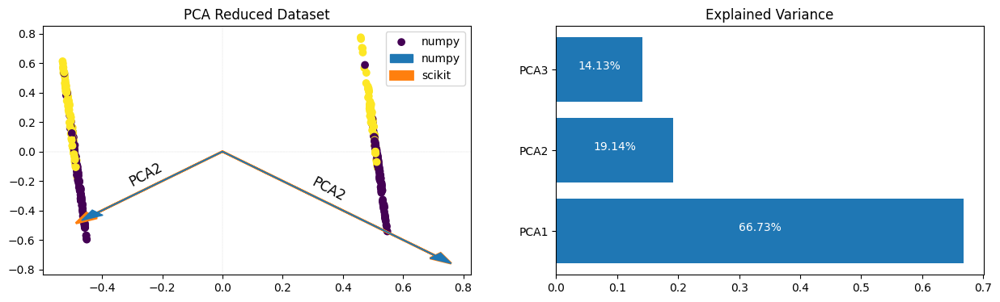
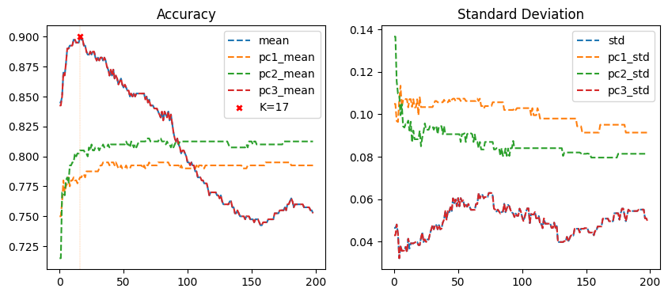

# Abstract
This study explores the integration of k-Nearest Neighbors (kNN) algorithm with Principal Component Analysis (PCA) to accelerate learning and improve classification accuracy. The assignment tasks involve implementing a custom kNN algorithm for multi-class classification, utilizing the Social Network Ads dataset, and conducting experiments to optimize kNN parameters and assess the impact of dimensionality reduction using PCA. The tasks include training the kNN model, evaluating its performance with various k values through k-fold cross-validation, implementing PCA to reduce dataset dimensions, and assessing the effectiveness of kNN classification on different subsets of principal components. The report discusses the methodologies, results, challenges, and conclusions drawn from the experiments, providing insights into the integration of kNN and PCA for enhanced pattern recognition.

## PCA
To perform Principal Component Analysis (PCA) we utilized the NumPy library for all computational tasks. We first computed the covariance matrix ( $\Sigma$ ) of the dataset, denoted by $X$, using the formula: [1]

$$ \sigma_{ij} = \frac{1}{n-1} \sum_{k=1}^{n} (X_{kj} - \bar{X}_j) \cdot $$

Next, we found the eigenvalues ( $\lambda$ ) of the covariance matrix by solving the characteristic equation [2]:

$$ \text{det} (\Sigma - \lambda I) = 0 $$

Then, for each eigenvalue, we solved the equation [2]:

$$ (\Sigma - \lambda I)v = 0$$

to find the corresponding eigenvectors ($v$). These eigenvectors represent the principal components of the dataset, which capture the directions of maximum variance.

### PCA Results

## KNN
The k-Nearest Neighbors (KNN) algorithm is a straightforward yet effective supervised learning approach primarily used for classification tasks [3]. It operates on the premise that similar data points are likely to belong to the same class. When given a new sample, KNN identifies the k nearest neighbors from the training dataset based on a chosen distance metric, such as Euclidean distance [4] [5].

$$\text{Euclidean distance}(\mathbf{p}, \mathbf{q}) = \sqrt{\sum_{i=1}^{n} (p_i - q_i)^2}$$

This formula calculates the straight-line distance between two points in Euclidean space, which is commonly used as a measure of similarity in KNN and many other machine learning algorithms.

In classification tasks, the majority class among these neighbors determines the class label assigned to the new sample. The hyperparameter $k$ plays a crucial role in KNN, as it determines the number of neighbors considered for classification. A larger value of $k$ leads to smoother decision boundaries, while a smaller value might result in overfitting.

Despite its simplicity, KNN has several characteristics to consider. While it's easy to understand and implement, it can be computationally expensive during prediction, particularly for large datasets, as it requires calculating distances between the test sample and all training samples [3].

## K-Fold Crossvalidation
Upon examining the provided cross-validation results, we observe interesting trends regarding the performance of the KNN classifier with varying $k$ values and PCA components.

Furthermore, when considering different PCA components, such as original features, PC1, PC2, and PC3, we discern variations in mean scores for the same $k$ value. This suggests that the choice of PCA components can significantly impact the classifier's performance. It's noteworthy that certain combinations of $k$ and PCA components yield higher mean scores compared to others, indicating the importance of parameter selection in achieving optimal classification results.

Interestingly, upon closer examination, we find that using PC1, PC2, and PC3 results in the same performance as using the original features. This implies that the information captured by the first three principal components is comparable to that of the original features in terms of discriminatory power for the classification task.

Additionally, the standard deviation values provide insights into the stability and variability of scores across multiple cross-validation runs. Lower standard deviation values imply more consistent performance, while higher values suggest greater variability. In our observations, we note that the standard deviation for both the original features and PC3 is considerably lower than that of using only PC1 or using PC1 and PC2. This indicates that the third component contains important information that contributes to the stability of the classification results.

## Comparison of Training Time
The table reports the training time (in milliseconds) for each configuration of PCA components. Using the original features (Original), the training time is 246 ms. When using only PC1 or PC2, the training time reduces to 206 ms, indicating a decrease in computational overhead. However, even when including all three principal components (PC1, PC2, and PC3), the training time remains relatively consistent at 241 ms, suggesting that the additional component doesn't significantly impact training time compared to using just PC1 or PC2.

1. **Standard Deviation of Training Time**:
   The standard deviation of training time is an indicator of the stability or consistency of the training process. Using PC1 or PC2 results in a significantly lower standard deviation compared to using the original features, indicating more consistent training times. However, using PC3 results in a higher standard deviation compared to PC1 or PC2, suggesting some variability in training time when including PC3.

2. **Prediction Accuracy**:
   The table also provides the prediction accuracy (Score) for each configuration. Using the original features or including PC3 alone results in a prediction accuracy of 0.90, indicating no loss in accuracy compared to using PC1 or PC2 alone. However, using only PC1 or PC2 results in a slightly lower prediction accuracy of 0.78 and 0.80, respectively, compared to using the original features or including PC3.

3. **Interpretation**:
   Using PCA components for dimensionality reduction can lead to computational efficiency. However, the choice of PCA components can impact prediction accuracy, with PC1 and PC2 alone resulting in a slight decrease in accuracy compared to using the original features or including PC3. The variability in training time when including PC3 suggests that this component may introduce some complexity or variability in the training process, possibly due to capturing less relevant information or noise.

In conclusion, the choice of PCA components for dimensionality reduction in KNN algorithms involves a trade-off between computational efficiency and prediction accuracy, with considerations for both training time and accuracy being essential in decision-making.

## References
1. Christopher M. Bishop, *Pattern Recognition and Machine Learning*. Springer, 2006.
2. Lecture Notes, 2024
3. OpenAI, ChatGPT (Version 3.5), [Link](https://openai.com/chatgpt), Accessed on: 22. March 2024.
4. Cuemath, "Covariance Matrix," [Link](https://www.cuemath.com/algebra/covariance-matrix/), Accessed on: 14. April 2024.
5. H. Anton and C. Rorres, *Elementary Linear Algebra:
